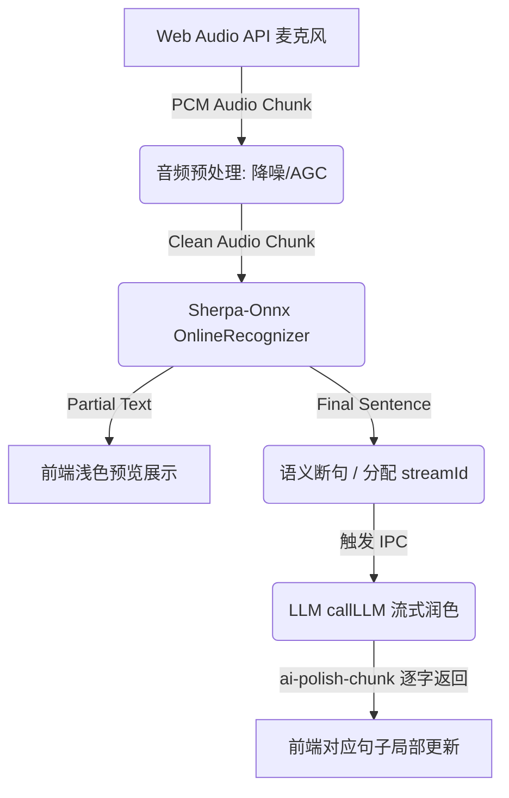

# 实时语音输入增强及 LLM 流式润色技术方案

## 1. 需求背景
为了提升桌面备忘录的语音输入体验，当前基于 `sherpa-onnx-node` 的 ASR 模块需要进一步升级。核心目标是实现复杂环境下的**实时背景声降噪**、**人声提取与保留**、**低延迟实时 ASR 识别**，并利用本地或云端 LLM 实现**实时流式文本润色**（去除语气词、修正语病、排版优化），最终输出高质量的备忘录文本。

---

## 2. 系统架构设计

整个语音处理流将分为四个核心阶段：**音频采集与预处理** -> **ASR 实时解码** -> **语义分段** -> **LLM 流式并发润色**。



---

## 3. 关键技术选型与实现

### 3.1 实时背景声降噪与人声保留 (Audio Pre-processing)
*   **基础方案 (WebRTC 级降噪)**：
    在 Renderer 进程获取麦克风权限时，开启浏览器的硬件级/系统级 DSP 增强。
    ```javascript
    navigator.mediaDevices.getUserMedia({
      audio: {
        noiseSuppression: true, // 背景降噪
        echoCancellation: true, // 回声消除
        autoGainControl: true   // 自动增益控制 (人声保留)
      }
    })
    ```
*   **进阶方案 (预留)**：如有更极端的降噪需求，后续可通过引入 `rnnoise-wasm` 和 `AudioWorklet` 实现深度学习级前端降噪。

### 3.2 实时 ASR 识别 (Real-time ASR)
*   **引擎改造**：现有的 `src/main/asr/engine.ts` 需要从一次性识别重构，暴露出流式接口。利用 `sherpa-onnx-node` 的 `OnlineRecognizer` API 进行流式解码。
*   **数据流转**：
    *   前端 `AudioWorklet` 将处理后的 `16kHz, Float32` 音频数据按块（如每 100ms）通过 IPC 发送到 Main 进程。
    *   主进程持续 `acceptWaveform` 并调用 `decode`。
*   **状态反馈**：
    *   实时返回 `partial_result` 给前端展示。
    *   利用 VAD (Voice Activity Detection) 识别到用户停顿，返回 `final_result`，**这是触发 LLM 润色的关键节点**。

### 3.3 LLM 实时流式润色 (Streaming LLM Polishing)
*   **可行性分析**：基于已有的代码库，`src/main/ai/conversation.ts` 中的 `callLLM` 已完整支持 `onDelta` 回调，具备极好的流式输出能力。我们只需复用该接口。
*   **触发时机（句级处理）**：
    LLM 无法逐字进行有效润色（会导致语义断裂），必须按**“句”**或**“意群”**为单位。当 ASR 输出一个 `final_result`（完整句子）时，立即启动一个润色任务。
*   **并发队列与状态管理（解决用户连说问题）**：
    当用户语速较快时，可能第一句正在被 LLM 润色，第二句已经识别完毕并触发了新的润色。
    *   **主进程**：为每个润色请求分配独立的 `streamId`，允许大模型产生并发请求。
    *   **前端展示**：维护一个分段的数据结构，例如：
        ```typescript
        interface SpeechSegment {
          id: string;          // 唯一标识 (streamId)
          raw: string;         // ASR 原始结果
          polished: string;    // LLM 润色后的结果（实时拼接）
          status: 'asr_done' | 'polishing' | 'done' | 'error';
        }
        ```
    *   前端通过监听 IPC 传回的 `streamId`，将大模型吐出的单个字精确拼接到对应的 `SpeechSegment.polished` 字段中，实现多个句子**“并行边说边润色”**的视觉奇观。

---

## 4. 核心数据流设计 (IPC 通信)

方案将新增/修改以下 IPC 通道：

1.  **前端 -> 主进程 (ASR 输入)**
    *   `asr:start-stream`: 启动在线识别引擎。
    *   `asr:audio-chunk`: 持续发送 Float32 音频数组。
2.  **主进程 -> 前端 (ASR 输出)**
    *   `asr:progress`: `{ type: 'partial' | 'final', text: '...', segmentId: '...' }`
3.  **前端 -> 主进程 (LLM 润色)**
    *   `ai:polish-stream`: 发送需润色的单句。
        *   入参：`{ text: "待润色文本", streamId: "12345" }`
4.  **主进程 -> 前端 (LLM 流式输出)**
    *   `ai:polish-chunk`: 实时返回润色文字块。
        *   返回：`{ streamId: "12345", content: "今天", type: "chunk" | "done" | "error" }`

---

## 5. 实施计划 (暂不修改代码)

1.  **评审方案**：确认基于 VAD 句级断点 + 并发 `streamId` 流式更新的交互方案是否符合预期。
2.  **主进程改造**：
    *   新增 `ai:polish-stream` IPC 监听，调用底层 `callLLM`。
    *   改造 `asrEngine` 支持 `OnlineRecognizer`。
3.  **前端改造**：
    *   重构 `VoiceInputButton` 内部状态，支持多段 `SpeechSegment` 的并发渲染。
    *   接通 Web Audio API，添加 AGC 与降噪约束，向主进程推送数据。